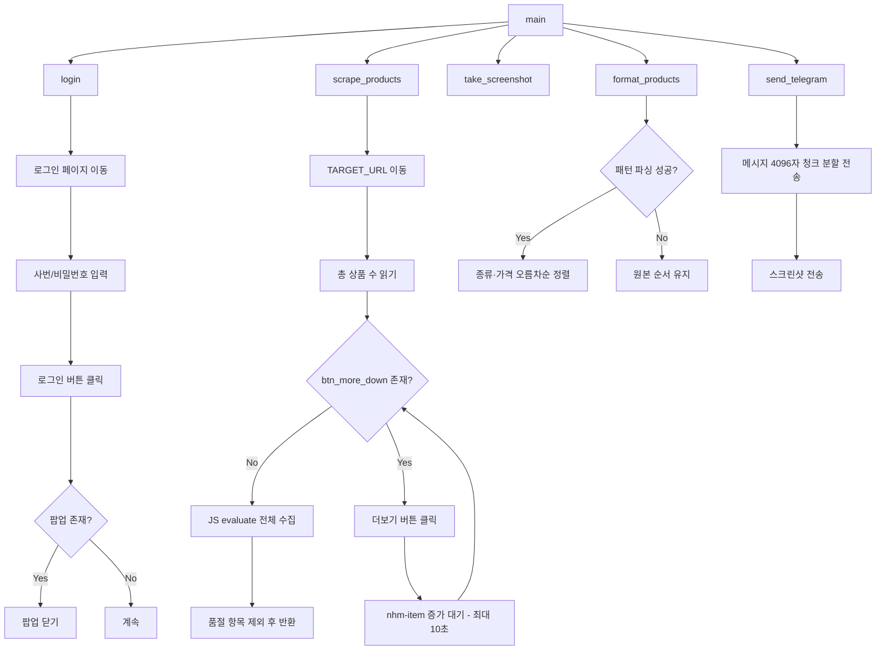

# Design Document

## Overview

LG U+ Life Care 스크래퍼는 `lguplus.lglifecare.com`에 사번으로 로그인하여 LG등급 카테고리의 상품명·가격을 전체 페이지에 걸쳐 수집하고, 결과를 텔레그램 봇으로 전송하는 단일 파일 Python 스크립트입니다.

현재 `main.py`에 로그인·크롤링·스크린샷·텔레그램 전송이 구현되어 있으며, 이 설계 문서는 실제 구현을 기준으로 작성되었습니다.

### 핵심 설계 결정

- **단일 파일 구조**: 모든 로직은 `main.py` 한 파일에 위치 (400줄 이내)
- **비동기 실행**: `asyncio` + Playwright async API로 I/O 대기 최소화
- **상품 로드 전략**: `button.btn_more_down` 클릭 반복으로 단일 페이지 DOM에 전체 상품 누적 로드 후 JS evaluate로 한 번에 수집
- **품절 필터링**: `.sold_txt` 요소 포함 항목은 JavaScript evaluate 단계에서 제외
- **SSL 우회**: 회사 네트워크 self-signed 인증서 대응을 위해 `HTTPXRequest(verify=False)` 사용

---

## Architecture



### 실행 흐름

1. `main()` — Playwright 브라우저 컨텍스트 생성 및 파이프라인 오케스트레이션
2. `login(page)` — 사번 인증 및 팝업 처리
3. `scrape_products(page)` — 전체 페이지 순회 상품 수집
4. `take_screenshot(page)` — 타임스탬프 파일명으로 스크린샷 저장
5. `format_products(products, total)` — 정렬·포맷팅 후 텍스트 생성
6. `send_telegram(message, screenshot_path)` — 텔레그램 메시지 + 이미지 전송

---

## Components and Interfaces

### login(page: Page) → None

```python
async def login(page: Page) -> None
```

- `https://lguplus.lglifecare.com/auth/login` 이동
- `input#id[name="id"]` ← `LG_ID`
- `input[name="password"]` ← `LG_PW`
- `button.again-btn_bg_gradient` 클릭
- `.todayClosePop` 팝업 5초 대기 후 닫기 (없으면 무시)

### scrape_products(page: Page) → tuple[list[dict], str]

```python
async def scrape_products(page: Page) -> tuple[list[dict], str]
```

반환값: `(products, total)`
- `products`: `[{"name": str, "price": str}, ...]` — 품절 제외 상품 목록
- `total`: `.txt_mb .num` 텍스트 (총 상품 수, 파싱 실패 시 `"?"`)

**더보기 버튼 클릭 루프**:
```
while True:
    more_btn = page.locator('button.btn_more_down')
    if count == 0 or not visible: break
    prev_count = .nhm-item 개수
    more_btn.click()
    wait_for_function(.nhm-item 개수 > prev_count, timeout=10000)

products = JS evaluate(전체 .nhm-item 수집, .sold_txt 제외)
```

### take_screenshot(page: Page) → Path

```python
async def take_screenshot(page: Page) -> Path
```

- `screenshots/capture_{YYYYMMDD_HHMMSS}.png` 저장
- `screenshots/` 디렉토리 자동 생성 (`Path.mkdir(exist_ok=True)`)

### format_products(products: list[dict], total: str) → str

```python
def format_products(products: list[dict], total: str) -> str
```

- 헤더: `총 {total}개 중 {collected}개 수집 (품절 제외)\n{TARGET_URL}`
- 패턴 `[등급][종류]모델명 / 가격` 파싱 성공 시: 종류(1차) + 가격 오름차순(2차) 정렬
- 파싱 실패 시: 원본 순서 그대로

### send_telegram(message: str, screenshot_path: Path) → None

```python
async def send_telegram(message: str, screenshot_path: Path) -> None
```

- `Bot(token=TELEGRAM_BOT_TOKEN, request=HTTPXRequest(http_version="1.1", httpx_kwargs={"verify": False}))`
- 회사 네트워크 self-signed 인증서 우회를 위해 SSL 검증 비활성화
- 메시지를 4096자 단위로 청크 분할하여 순서대로 `send_message`
- 마지막으로 `send_photo`로 스크린샷 전송

---

## Data Models

### Product

```python
{
    "name": str,   # 상품명 (.tit_cpn.ga-prd-click 텍스트)
    "price": str   # 가격 (.num-disPrice span 텍스트, 예: "1,234,000")
}
```

### Environment Variables

| 변수명 | 설명 |
|---|---|
| `LG_ID` | 사번 (로그인 ID) |
| `LG_PW` | 비밀번호 |
| `TARGET_URL` | 상품 카테고리 페이지 기본 URL |
| `TELEGRAM_BOT_TOKEN` | 텔레그램 봇 토큰 |
| `TELEGRAM_CHAT_ID` | 전송 대상 채팅방 ID |

### 페이지네이션 URL 패턴

```
1페이지: TARGET_URL
2페이지: TARGET_URL + "&page=2"
n페이지: TARGET_URL + f"&page={n}"
```

### 스크린샷 파일명 패턴

```
정상: screenshots/capture_{YYYYMMDD_HHMMSS}.png
에러: screenshots/error_{YYYYMMDD_HHMMSS}.png
```

> 스크린샷은 `full_page=False`로 현재 뷰포트(1280×720)만 캡처합니다. 전체 페이지 스크롤 캡처 시 텔레그램 이미지 크기 제한(`Photo_invalid_dimensions`)을 초과할 수 있습니다.


---

## Correctness Properties

*A property is a characteristic or behavior that should hold true across all valid executions of a system — essentially, a formal statement about what the system should do. Properties serve as the bridge between human-readable specifications and machine-verifiable correctness guarantees.*

### Property 1: 더보기 버튼 클릭 후 DOM 증가 보장

*For any* 더보기 버튼 클릭 이전의 `.nhm-item` 개수 `prev_count`에 대해, 클릭 후 DOM의 `.nhm-item` 개수는 반드시 `prev_count`보다 커야 한다. 즉, 더보기 클릭은 항상 새 상품을 DOM에 추가해야 한다.

**Validates: Requirements 2.3, 2.4**

### Property 2: 더보기 루프 종료 조건

*For any* 수집 루프 실행에서, `button.btn_more_down`이 존재하지 않거나 비표시 상태이면 루프는 반드시 종료되어야 한다. 즉, 종료 조건이 충족된 이후에는 추가 클릭이 발생하지 않아야 한다.

**Validates: Requirements 2.5**

### Property 3: 포맷팅 헤더 형식

*For any* 상품 목록과 `total` 값에 대해, `format_products`가 반환하는 문자열의 첫 번째 줄은 항상 `총 {total}개 중 {collected}개 수집 (품절 제외)` 형식이어야 하고, 두 번째 줄은 `TARGET_URL`이어야 한다.

**Validates: Requirements 4.4, 4.5**

### Property 4: 정렬 불변성

*For any* 패턴 `[등급][종류]모델명 / 가격`에 매칭되는 상품 목록에 대해, `format_products`의 출력은 항상 종류(1차) 오름차순, 동일 종류 내 가격(2차) 오름차순으로 정렬되어야 한다.

**Validates: Requirements 4.2**

### Property 5: 파싱 실패 시 원본 순서 보존

*For any* 패턴에 매칭되지 않는 상품명을 포함하는 목록에 대해, `format_products`의 출력 상품 순서는 입력 순서와 동일해야 한다.

**Validates: Requirements 4.3**

### Property 6: 메시지 청크 분할 라운드트립

*For any* 임의 길이의 메시지 문자열에 대해, 4096자 단위로 분할된 청크들을 순서대로 이어 붙이면 원본 메시지와 동일해야 하며, 각 청크의 길이는 4096자를 초과하지 않아야 한다.

**Validates: Requirements 5.2**

### Property 7: 스크린샷 파일명 패턴

*For any* 임의의 `datetime` 값에 대해, 생성된 스크린샷 파일명은 항상 `capture_YYYYMMDD_HHMMSS.png` 형식을 따라야 한다 (에러 스크린샷은 `error_YYYYMMDD_HHMMSS.png`).

**Validates: Requirements 3.2**

---

## Error Handling

### 로그인 실패
- 팝업 대기 타임아웃(5초)은 `try/except`로 처리하여 팝업 없음으로 간주하고 계속 진행
- 로그인 자체 실패(잘못된 자격증명 등)는 `main()`의 `except` 블록에서 에러 스크린샷 저장 후 예외 재발생

### 페이지 로드 실패
- `page.goto()` 및 `wait_for_load_state()` 타임아웃(30초) 초과 시 Playwright `TimeoutError` 발생
- `main()`의 `except` 블록에서 `screenshots/error_{timestamp}.png` 저장 후 예외 재발생

### 상품 수집 실패
- `.txt_mb .num` 요소 없을 경우 `total = "?"` 폴백
- JS evaluate 결과가 빈 리스트이면 루프 즉시 종료 (정상 종료 조건)

### 텔레그램 전송 실패
- `python-telegram-bot` 라이브러리의 예외가 `main()`까지 전파됨
- 에러 스크린샷 저장 후 예외 재발생

### 브라우저 정리
- `finally` 블록에서 `browser.close()` 항상 실행 (정상/에러 모두)

---

## Testing Strategy

### 이중 테스트 접근법

단위 테스트와 속성 기반 테스트를 함께 사용하여 포괄적인 검증을 수행합니다.

- **단위 테스트 (pytest)**: 구체적인 예시, 엣지 케이스, 에러 조건 검증
- **속성 기반 테스트 (Hypothesis)**: 임의 입력에 대한 보편적 속성 검증 (최소 100회 반복)

### 속성 기반 테스트 라이브러리

**Hypothesis** (`hypothesis` PyPI 패키지)를 사용합니다. Playwright 의존성 없이 순수 Python 함수(`format_products`, URL 생성 로직)를 대상으로 합니다.

### 테스트 파일 구조

```
tests/
└── test_main.py   # 단위 테스트 + 속성 기반 테스트 통합
```

### 단위 테스트 항목

| 테스트 | 검증 내용 | 요구사항 |
|---|---|---|
| `test_format_products_empty` | 상품 0개일 때 헤더만 포함 | 5.4 |
| `test_screenshot_dir_created` | `screenshots/` 디렉토리 자동 생성 | 3.3 |
| `test_format_products_no_pattern` | 패턴 불일치 시 원본 순서 유지 | 4.3 |

### 속성 기반 테스트 항목

각 속성 테스트는 최소 100회 반복 실행하며, 태그 형식: `Feature: lg-lifecare-scraper, Property {N}: {설명}`

| 속성 | 테스트 함수 | 요구사항 |
|---|---|---|
| Property 2 | `test_more_btn_loop_termination` | 2.5 |
| Property 3 | `test_format_header_format` | 4.4, 4.5 |
| Property 4 | `test_format_products_sorted` | 4.2 |
| Property 5 | `test_format_products_fallback_order` | 4.3 |
| Property 6 | `test_message_chunk_roundtrip` | 5.2 |
| Property 7 | `test_screenshot_filename_pattern` | 3.2 |

### 테스트 예시 (Hypothesis)

```python
from hypothesis import given, settings
import hypothesis.strategies as st

# Feature: lg-lifecare-scraper, Property 6: 메시지 청크 분할 라운드트립
@given(st.text(min_size=0, max_size=20000))
@settings(max_examples=100)
def test_message_chunk_roundtrip(message):
    chunks = [message[i:i+4096] for i in range(0, max(len(message), 1), 4096)]
    assert all(len(c) <= 4096 for c in chunks)
    assert "".join(chunks) == message

# Feature: lg-lifecare-scraper, Property 4: 정렬 불변성
@given(st.lists(
    st.fixed_dictionaries({
        "name": st.from_regex(r'\[[A-Z]+\]\[[가-힣]+\]\S+', fullmatch=True),
        "price": st.from_regex(r'\d{1,3}(,\d{3})*', fullmatch=True)
    }),
    min_size=1
))
@settings(max_examples=100)
def test_format_products_sorted(products):
    result = format_products(products, str(len(products)))
    # 정렬 결과 검증 로직
    ...
```

### Playwright 통합 테스트

로그인·스크래핑·스크린샷·텔레그램 전송은 실제 브라우저와 외부 서비스에 의존하므로 자동화 단위 테스트 범위에서 제외합니다. 이 기능들은 수동 통합 테스트 또는 별도 E2E 테스트 스크립트(`_test_pagination.py` 등)로 검증합니다.
